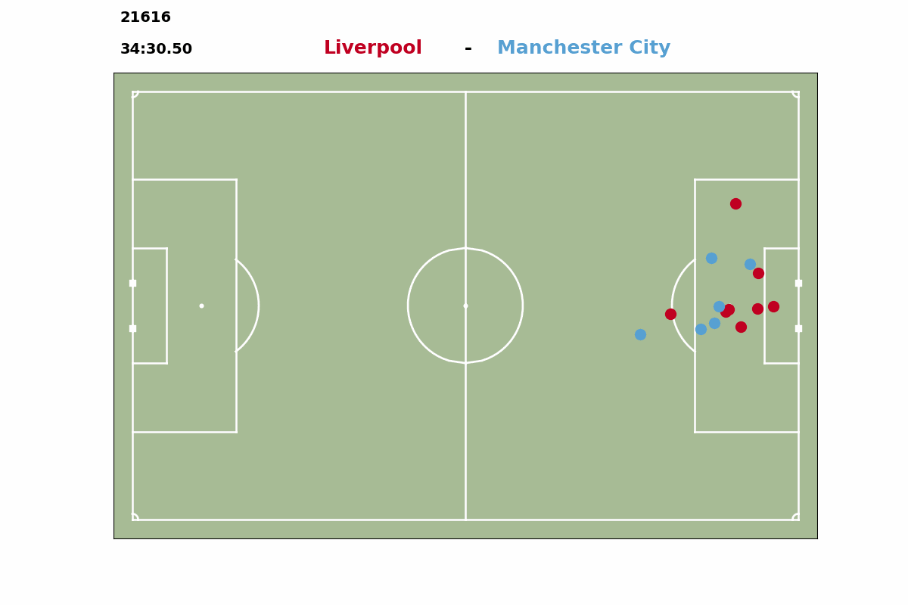

# Corner Kicks Analysis

Using Skillcorner broadcast tracking data - creation of a model that identifies corner kick situations 

:woman: Author : Chloé Gobé 

:calendar: Date : 28.05.2023

<p align="center">
  
</p>

### Summary
1. [Description of the project](#description)
2. [Structure of the repository](#repo)
3. [Data](#data)
4. [References](#sources)


## Identification of corner kicks situations <a id="description"></a>
The project focuses on identifiying corner kicks situations from SkillCorner open data and handling these situations in order to produce some analysis for a fictionnal staff.

A **report** is available to explain the methods used, the pros and cons, and what could have been done given more time.

## Structure of the repository <a id="repo"></a>

The tutorial about how to use the functions and code is in the notebook `corner-kicks.ipynb`

```bash
|── code
│   ├── __init__.py
│   ├── match_toolbox.py
│   ├── corner_kicks_finder.py
│   └── pitch.py
├── gif
│   ├── LIV-MCI_20687.gif
│   ├── ...
├── pickle
│   ├── 2068.pkl
│   ├── ...
├── .gitignore
├── corner-kicks.ipynb
├── README.md
├── Report.md
└── requirements.txt
```

:file_folder: **code**

Contains all the code used within the project :

- `match_toolbook.py` : Load the match data, transform and add information about the match, plot and draw what is happening on a frame.

	```python
	match = Match(match_id)
	match.gather_information()
	match.plot_frame(frame_id)
	``` 

- `corner_kicks_finder.py`: define functions that are criterias for corner kicks identification and launch an analysis on all the matches availble. Store the results into the pickle folder  

	```python
	analyzer = CornerKickFinder(match_id)
	analyzer.find_potentiel_corner_kicks()
	```

- `pitch.py`: to draw a pitch, function by Laurie Shaw

    ```python
    plot_pitch()
    ```

:file_folder: **gif**

Contains the gif of the actions produce when using the code

:file_folder: **pickle**

Contains all the pickle files with the potential corner kicks situations identified with the corner kicks finder


## Data <a id="data"></a>

The data used comes from [Skillcorner open data](https://github.com/SkillCorner/opendata)

Matches available :

- ID: 4039 - Manchester City vs Liverpool on 2020-07-02
- ID: 3749 - Dortmund vs Bayern Munchen on 2020-05-26 
- ID: 3518 - Juventus vs Inter on 2020-03-08
- ID: 3442 - Real Madrid vs FC Barcelona on 2020-03-01
- ID: 2841 - FC Barcelona vs Real Madrid on 2019-12-18
- ID: 2440 - Liverpool vs Manchester City on 2019-11-10
- ID: 2417 - Bayern Munchen vs Dortmund on 2019-11-09 
- ID: 2269 - Paris vs Marseille on 2019-10-27
- ID: 2068 - Inter vs Juventus on 2019-10-06

## References <a id="sources"></a>

- **Automatic event detection in football using tracking data** Vidal-Codina, Ferran & Evans, Nicolas & Fakir, Bahaeddine & Billingham, Johsan. (2022) Sports Engineering. 25. 10.1007/s12283-022-00381-6. [[pdf]](https://www.researchgate.net/publication/363324413_Automatic_event_detection_in_football_using_tracking_data)
- **Routine Inspection: A playbook for corner kicks**, Laurie Shaw, Sudarshan Gopaladesikan (Sloan Sports Analytics Conference, 2020) [[pdf]](https://global-uploads.webflow.com/5f1af76ed86d6771ad48324b/606e51c17bf6c8ba83d69a01_LaurieShaw-CornerKicks-RPpaper.pdf)
- **Mythbusting Set-Pieces in Soccer**, Power, P., Hobbs, J., Ruiz, H., Wei, X., Lucey, (Sloan Sports Analytics Conference, 2018)[[pdf]](https://sportdocbox.com/World_Soccer/72816302-Mythbusting-set-pieces-in-soccer.html)
- **Analysis of corner kick success in elite soccer**, Casal, C. A., Maneiro, R., Arda, T., Losada, J. L., & Rial, A.In (International Journal of Performance Analysis in Sport, 15, 430–451, 2015)[[pdf]](https://www.researchgate.net/publication/280394889_Analysis_of_Corner_Kick_Success_in_Elite_Football)
- **Analysis of attacking corner kick strategies in the FA women’s super league 2017/2018**, Hannah Beare & Joseph Antony Stone, (International Journal of Performance Analysis in Sport, 19:6, 893-903, DOI: 10.1080/24748668.2019.1677329) [[pdf]](https://shura.shu.ac.uk/25242/3/Stone-AnalysisAttacking%20Corner%28AM%29.pdf)
